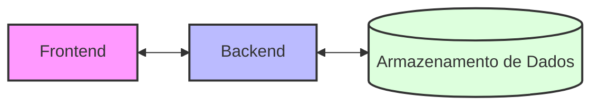
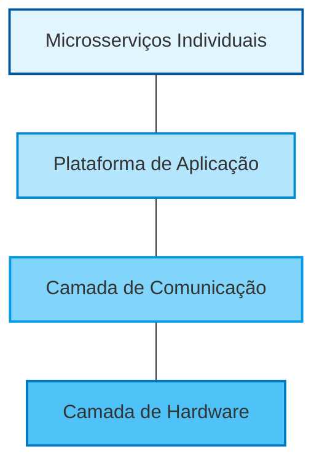

 

<b>Capítulo 1 - Microsserviços</b>

 

A autora inicia o livro argumentando que, embora os conceitos fundamentais por trás dos microsserviços não sejam novos, “a aplicação contemporânea da arquitetura de microsserviços é atual”. Ela justifica que essa adoção é motivada pelos <b>desafios de escalabilidade, falta de eficiência, velocidade lenta de desenvolvimento e dificuldades em adotar novas tecnologias</b> que ocorrem quando sistemas complexos são implantados como uma grande aplicação monolítica.
Ao longo de todo o capítulo, é ressaltado que um ecossistema de microsserviços bem-sucedido e escalável precisa de uma infraestrutura estável e sofisticada.

 

    <b>De monólitos a microsserviços</b>

 

A autora afirma que a maioria das aplicações de software segue uma arquitetura de três camadas: frontend, backend e armazenamento de dados. Esses elementos podem ser combinados ou separados de diferentes formas, mas independentemente da organização adotada, uma aplicação é sempre entendida como a soma desses três componentes distintos.

Em seguida, ela descreve alguns dos problemas clássicos da estrutura de monólitos: com a evolução do produto, a aplicação passa a conter milhares de linhas de códigos, e centenas de testes precisam ser escritos para garantir que qualquer alteração feita não comprometa a integridade do código já existente. Isso atrasa o ciclo de desenvolvimento e dificulta a implantação de correções cruciais para o negócio. 

“A razão pela qual a maioria dos monólitos é suscetível a esses problemas é a natureza de um monólito ser diretamente oposta à escalabilidade em termos mais gerais possíveis. Escalabilidade requer <i>simultaneidade e segmentação</i>: duas condições que são difíceis de ser obtidas com um monólito.”

Para fortalecer o seu argumento, Susan Fowler traz uma lista de empresas que passaram a enfrentar desafios de escalabilidade com os seus monólitos, e que superaram seus problemas adotando microsserviços: Amazon, Twitter, Netflix, eBay e Uber.

É importante fazer uma distinção mais concreta entre o que é uma arquitetura de microsserviços e uma de monólitos, para além do que o nome sugere. Desta forma, o livro ensina que, na aplicação monolítica, todos os recursos e funções encontram-se dentro de uma só aplicação e um código-base, todos implantados ao mesmo tempo, com cada servidor hospedando uma cópia completa de toda a aplicação. O microsserviço, por outro lado, contém apenas uma única função, e é executado em um <i>ecossistema de microsserviços</i>.

Entretanto, é importante ressaltar que normalmente empresas adotam essa estrutura depois de terem construído uma aplicação e encontrado desafios organizacionais e de escalabilidade. “Elas começam com uma aplicação monolítica e depois dividem o monólito em microsserviços.”

Voltando ao termo “ecossistema de microsserviços”, destaca-se que, ao dividir um monólito em microsserviços, as responsabilidades da infraestrutura organizacional em prover uma plataforma estável para que os microsserviços sejam desenvolvidos e mantidos crescem <b>drasticamente</b>, e o livro passa a discutir sobre o trabalho envolvido da divisão do monólito em microsserviços.

A autora afirma que, apesar de parecer vantajoso iniciar diretamente com microsserviços, empresas pequenas geralmente não possuem maturidade operacional, infraestrutura estável nem clareza funcional suficientes para sustentar esse modelo, o que torna a adoção prematura dessa arquitetura inviável na maioria dos casos.

 

    <b>Arquitetura de microsserviços</b>

 

Na arquitetura de microsserviços, o elemento frontend (<i>client-side</i>) não é a típica aplicação/interface gráfica, mas sim uma API (interface de programação de aplicação) com <i>endpoints</i> estáticos. Os endpoints da API dos microsserviços devem ser padronizados em toda a organização, utilizando o mesmo protocolo (como por exemplo REST ou Apache Thrift). Um microsserviço com endpoints do tipo REST provavelmente irá interagir com outros microsserviços via HTTP, enquanto que outro com endpoints do tipo Thrift pode utilizar outras soluções.

Assim como tudo na programação, qualquer tipo de endpoint e qualquer tipo de protocolo usado para comunicação com outros microsserviços terão benefícios e contrapartidas (<i>trade-offs</i>).
        
A autora argumenta que um microsserviço pode ser tratado pelos outros como uma caixa-preta: você insere alguma informação enviando uma solicitação para um de seus endpoints e obtém uma saída. Se você obtiver o que deseja em um tempo razoável, é sinal de que o microsserviço cumpriu o seu papel.

 

    <b>Ecossistema de microsserviços</b>

 

O livro argumenta que o ecossistema de microsserviços pode ser dividido em quatro camadas: <b>a camada de hardware, a camada de comunicação, a plataforma de aplicação e os microsserviços individuais</b>. 

Num cenário bem projetado e sustentável, os microsserviços são separados de toda a infraestrutura: separados do hardware, das redes, da pipeline de build e deploy, do <i>service discovery</i>, do <i>load balancer</i> etc… e manter essa infraestrutura de maneira estável, escalável, tolerante a falhas e confiável é um fator essencial para a operação de uma empresa. Agora, vamos analisar cada uma das quatro camadas individualmente.

 

    <b>Camada 1: Hardware</b>

 
É a base do ecossistema. Trata-se das máquinas propriamente ditas, computadores reais e físicos. Muitos tipos diferentes de servidores podem estar presentes: alguns são otimizados para databases, outros para processar tarefas que exigem muita CPU. Os servidores podem ser de propriedade da própria empresa ou “alugados” dos provedores de serviços de nuvem, como o Elastic Compute Cloud (AWS EC2) da Amazon, o Google Cloud Platform (GCP) ou o Microsoft Azure.

Escolher entre servidores físicos e um provedor na nuvem “não é uma decisão fácil, e é preciso levar em conta o custo, a disponibilidade, a confiabilidade e as despesas operacionais”. A maioria dos ecossistemas de microsserviços roda em alguma variante do Linux, geralmente o CentOS, o Debian ou o Ubuntu.

    <b>Resumo da camada 1: a camada de hardware</b>

 

- Servidores físicos (alugados de nuvem também contam como servidores físicos)
- Databases (dedicados e/ou compartilhados)
- O sistema operacional
- Isolamento e abstração de recursos
- Gerenciamento de configuração
- Monitoração a nível de servidor
- Logging a nível de servidor.

    <b>Camada 2: Comunicação</b>

 

A camada de comunicação se espalha por todas as outras camadas do ecossistema, pois é nela que toda a comunicação entre os serviços é tratada. A segunda camada contém a rede, o DNS, os RPCs e os endpoints de API, o service discovery, o service registry e o balanceamento de carga.

O paradigma mais comum de comunicação é o HTTP + REST/THRIFT. Os serviços se comunicam entre si pela rede usando HTTP e enviando solicitações e recebendo respostas de endpoints específicos do tipo REST, usando seus respectivos métodos (GET, POST etc.). Geralmente os dados são formatados e enviados como JSON. É um método que não apresenta surpresas, é fácil de configurar e é estável e confiável. A desvantagem de adotar este paradigma é que ele é, por necessidade, síncrono (bloqueante). 

O segundo paradigma de comunicação é a troca de mensagens (messaging), que é assíncrona (não bloqueante), contudo, não é o foco deste resumo discutir estes paradigmas.

Diferente do modelo monolítico, a arquitetura de microsserviços exige o roteamento de tráfego entre múltiplas aplicações. Isso demanda a implementação de mecanismos de descoberta, registro e balanceamento de carga na camada de comunicação. Tais recursos são fundamentais para que um serviço localize os endereços IP e as portas das instâncias disponíveis, utilizando um registro centralizado que cataloga todos os componentes do ecossistema. O balanceamento de carga garante que o tráfego será distribuído por todas as instâncias do serviço, e as soluções mais comuns para este problema são o Elastic Load Balancer da AWS e o Nginx.

    <b>Resumo da camada 2: a camada de comunicação</b>

 

- Rede
- DNS
- Remote Procedure Calls (RPCs)
- Endpoint
- Troca de mensagens
- Descoberta de serviço
- Registro de serviço
- Balanceamento de carga

    <b>Camada 3: a plataforma de aplicação</b>

 

Nesta camada, estão contidas as ferramentas e os serviços internos que são independentes dos microsserviços. Ou seja, é a camada que permite um processo de desenvolvimento padronizado, um sistema de build e release centralizado e automatizado, testes automatizados, logging e monitoramento centralizados, entre outros detalhes cruciais para o bom funcionamento do ecossistema. 

    <b>Ciclo de desenvolvimento</b>

 

É preciso otimizar e padronizar o processo de desenvolvimento para que ele seja estável e confiável. O primeiro requisito para isto é um sistema de controle de versão, para que desenvolvedores possam trabalhar paralelamente de forma eficaz. O segundo requisito é um ambiente de desenvolvimento estável e eficiente, e isso envolve garantir que o ambiente de homologação seja o mais similar possível ao de produção.

    <b>Teste, build, empacotamento e liberação</b>

 

As etapas de teste, build, empacotamento e liberação entre o desenvolvimento e a implantação devem ser padronizadas e centralizadas o máximo possível. É para isso que temos os processos de CI (integração contínua), facilitando a automação do processo e deixando pouco espaço para erros humanos.

    <b>Pipeline de deployment</b>

 

O pipeline de deployment automatiza a entrega de código em produção após as fases de build e teste. Em ecossistemas de microsserviços, a alta frequência de atualizações exige ferramentas padronizadas para garantir a estabilidade do processo, tornando esse passo essencial na construção de um ecossistema saudável.

    <b>Logging e monitoramento</b>

 

Todos os microsserviços devem manter um logging em nível de microsserviço de todas as solicitações feitas ao microsserviço e suas respostas. Muitas vezes é impossível reproduzir bugs no código, devido à dificuldade de reconstruir o estado do sistema no momento da falha, e um bom logging possibilita que os desenvolvedores entendam completamente o que ocorreu em algum momento com o seu serviço. 

    <b>Resumo da camada 3: a camada da plataforma de aplicação</b>

 

- Ferramentas internas de desenvolvimento do tipo autosserviço
- Ambiente de desenvolvimento
- Ferramentas de teste, empacotamento, build e liberação
- Pipeline de deployment
- Logging em nível de microsserviço
- Monitoramento em nível de microsserviço

    <b>Camada 4: Microsserviços</b>

 

Nesta camada é onde vivem os microsserviços, completamente separados das camadas inferiores de infraestrutura. Aqui eles vivem separados do hardware, da implantação, da descoberta de serviço, do balanceamento de carga e da comunicação. O que pode coexistir nesta camada são as configurações específicas de cada um dos microsserviços. 

    <b>Desafios organizacionais</b>

 

O livro argumenta desde o início, e seguirá com a sua tese, de que a adoção da arquitetura de microsserviços resolve os desafios mais frequentes apresentados pela arquitetura monolítica. Contudo, é importante saber que ele não é uma “bala de prata”, a solução mágica e perfeita para tudo. “Quando somos apresentados a uma tecnologia que promete oferecer melhorias drásticas, precisamos procurar as contrapartidas.” O livro lista quatro delas, inerentes à adoção da arquitetura de microsserviços: <b>a Lei de Conway Reversa, o aumento da dispersão técnica, a maior capacidade de falha do sistema e por último a competição por recursos de engenharia e infraestrutura</b>. Iremos analisar rapidamente cada uma delas.

    <b>Lei de Conway Reversa</b>

 

A arquitetura de microsserviços consiste em um grande número de pequenos serviços independentes e isolados, e muitas vezes a estrutura organizacional de uma empresa que segue este paradigma reflete isto. A estrutura de equipes resultante inevitavelmente leva aos fenômenos de segregação e dispersão. Nesse cenário, a Lei de Conway Reversa sugere que os desenvolvedores passam a espelhar os próprios microsserviços: tornam-se altamente especializados e eficientes em suas tarefas, porém isolados do restante do ecossistema em termos de domínio e responsabilidade.

Essa fragmentação gera um desafio organizacional crítico. Apesar de serem desenvolvidos em isolamento para garantir autonomia, os microsserviços não operam sozinhos e dependem de interações transparentes para que o produto final funcione. Contudo, promover essa colaboração é difícil na prática, já que os objetivos das equipes — frequentemente codificados em <b>OKRs específicos</b> para cada serviço — priorizam metas locais, o que pode desestimular a visão sistêmica e a cooperação entre times independentes.

    <b>Dispersão técnica</b>

 

Além da fragmentação organizacional, a arquitetura de microsserviços favorece o <b>déficit técnico</b>. Como as equipes têm autonomia para entregar novos recursos com rapidez, as dívidas de implementação costumam acumular-se silenciosamente. Esse problema torna-se evidente durante falhas ou interrupções: na urgência de restaurar o sistema, as equipes tendem a adotar soluções paliativas que apenas resolvem o sintoma imediato. No contexto de microsserviços, qualquer correção rápida é frequentemente considerada "suficiente", enquanto as soluções arquiteturais definitivas e ideais são indefinidamente adiadas, comprometendo a saúde do ecossistema a longo prazo.

    <b>Outras maneiras de falhar</b>

 

Pensando nas diversas conexões de um ecossistema, é inevitável o fato de que componentes individuais falharão, e falharão de uma maneira que ninguém pode prever. Aí reside o problema: a arquitetura de microsserviços introduz <i>novas maneiras de seu sistema falhar</i>. Não importa quantos testes de resiliência você execute, quantos cenários de falhas e catástrofes você cubra, não é possível escapar do fato de que seu sistema irá falhar.

    <b>Competição por recursos</b>

 

Somado aos desafios de segregação e déficit técnico, surge a competição por recursos, um fenômeno tão rigoroso no ecossistema de microsserviços quanto no mundo natural. Embora a arquitetura sugira uma expansão fluida, toda organização de engenharia opera sob limites finitos. De um lado, há o capital humano — equipes e desenvolvedores cujos esforços são disputados por diferentes projetos; de outro, os recursos de infraestrutura, como processamento em nuvem, armazenamento e instâncias de banco de dados. Como cada um desses componentes representa um custo financeiro elevado para a empresa, a gestão eficiente dessa escassez torna-se um dos maiores equilíbrios operacionais do modelo.

Cada equipe argumentará que suas necessidades são as mais importantes e que ficarão desapontadas se elas não forem incluídas nas melhorias promovidas pela empresa. Este tipo de competição pode gerar ressentimento entre as equipes. Além disso, quando existirem centenas ou milhares de equipes que poderiam ter um engenheiro extra, cada equipe irá insistir em afirmar que precisa desse trabalhador extra mais do que qualquer outra equipe.

Desta forma, fica resumido o primeiro capítulo do livro, que busca fazer um apanhado geral do porquê adotar a arquitetura de microsserviços e como estruturar um ecossistema saudável, mas também refletir sobre as limitações ao fazer a escolha por este padrão arquitetural de desenvolvimento.
